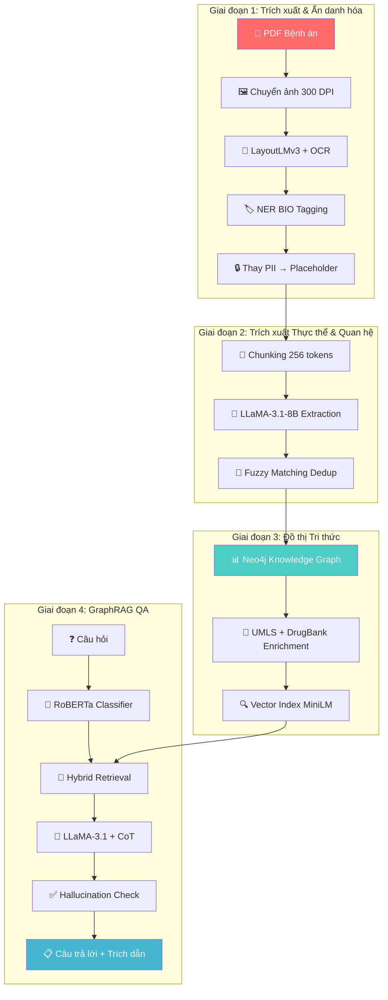
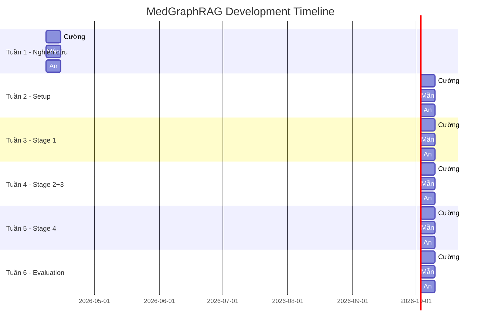

# 🏥 Kế Hoạch Phát Triển MedGraphRAG

> Nghiên cứu ứng dụng kỹ thuật GraphRAG trong phân tích và lập luận từ dữ liệu bệnh án điện tử

---

## 📋 Tổng Quan Kiến Trúc



---

## 🛠️ Technology Stack

| Thành phần | Công nghệ | Mục đích |
|---|---|---|
| **OCR & Layout** | LayoutLMv3 (microsoft/layoutlmv3-base) | Phân tích bố cục + NER trên PDF |
| **LLM** | LLaMA-3.1-8B (INT4 qua Ollama) | Trích xuất thực thể, sinh câu trả lời |
| **Graph DB** | Neo4j + GDS Plugin | Lưu trữ đồ thị tri thức, Leiden community detection |
| **Vector Embedding** | all-MiniLM-L6-v2 (384 dim) | Tìm kiếm ngữ nghĩa trong đồ thị |
| **RDBMS** | PostgreSQL | Lưu ánh xạ PII placeholder + metadata |
| **Object Storage** | MinIO | Lưu trữ PDF gốc |
| **API Framework** | FastAPI | Đóng gói pipeline end-to-end |
| **Classifier** | RoBERTa-base | Phân loại câu hỏi local/global |
| **Orchestration** | Docker Compose | Triển khai toàn bộ hạ tầng |
| **ML Framework** | HuggingFace Transformers + PyTorch | Huấn luyện & inference |

---

## 📁 Cấu Trúc Dự Án Đề Xuất

```
MedGraphRAG/
├── docker-compose.yml                # Neo4j + PostgreSQL + MinIO + Ollama
├── requirements.txt
├── config/
│   ├── settings.py                   # Cấu hình chung
│   └── neo4j_schema.cypher           # Schema đồ thị Neo4j
│
├── data/
│   ├── raw/                          # PDF gốc từ PDF-DeID Dataset
│   │   ├── easy/                     # 30 files
│   │   ├── medium/                   # 10 files
│   │   └── hard/                     # 10 files
│   ├── ground_truth/                 # JSON ground truth
│   └── processed/                    # Dữ liệu đã xử lý
│
├── src/
│   ├── stage1_deid/                  # Giai đoạn 1: De-identification
│   │   ├── pdf_to_image.py           # Chuyển PDF → ảnh 300 DPI
│   │   ├── ocr_processor.py          # OCR + bounding box extraction
│   │   ├── layoutlmv3_ner.py         # Fine-tune LayoutLMv3 cho NER
│   │   ├── bio_data_loader.py        # DataLoader format BIO
│   │   ├── trainer.py                # Training loop với early stopping
│   │   ├── postprocess.py            # Thay PII → [TYPE_ID] placeholder
│   │   └── evaluate.py               # Precision/Recall/F1 per entity type
│   │
│   ├── stage2_extraction/            # Giai đoạn 2: Entity & Relation Extraction
│   │   ├── chunker.py                # Sliding window 256 tokens, overlap 64
│   │   ├── entity_extractor.py       # LLaMA-3.1 structured prompting
│   │   ├── relation_extractor.py     # 5-shot in-context learning
│   │   ├── fuzzy_dedup.py            # Fuzzy matching dedup (threshold 0.85)
│   │   └── prompt_templates/
│   │       ├── entity_prompt.txt
│   │       └── relation_prompt.txt
│   │
│   ├── stage3_knowledge_graph/       # Giai đoạn 3: Knowledge Graph
│   │   ├── graph_builder.py          # Nạp node/edge vào Neo4j
│   │   ├── embedding_indexer.py      # Tạo vector embeddings + Neo4j Vector Index
│   │   ├── umls_enricher.py          # Tích hợp UMLS Metathesaurus
│   │   ├── drugbank_enricher.py      # Tích hợp DrugBank
│   │   └── community_detector.py     # Leiden algorithm + community summaries
│   │
│   ├── stage4_graphrag_qa/           # Giai đoạn 4: GraphRAG QA
│   │   ├── query_classifier.py       # RoBERTa local/global classifier
│   │   ├── local_retriever.py        # Vector + Cypher, k=10, 2-hop subgraph
│   │   ├── global_retriever.py       # Community summary map-reduce
│   │   ├── hybrid_retriever.py       # Weighted combination
│   │   ├── answer_generator.py       # LLaMA-3.1 + chain-of-thought
│   │   └── hallucination_checker.py  # Fact verification via Cypher
│   │
│   └── storage/                      # Module lưu trữ
│       ├── minio_client.py           # Upload/download PDF từ MinIO
│       ├── postgres_client.py        # CRUD ánh xạ PII (AES-256)
│       └── neo4j_client.py           # Neo4j driver wrapper
│
├── api/
│   ├── main.py                       # FastAPI app
│   ├── routes/
│   │   ├── ingest.py                 # POST /ingest - Nạp PDF mới
│   │   ├── query.py                  # POST /query - Hỏi đáp GraphRAG
│   │   └── graph.py                  # GET /graph - Trực quan hóa đồ thị
│   └── schemas.py                    # Pydantic models
│
├── evaluation/
│   ├── deid_eval.py                  # Đánh giá de-identification
│   ├── qa_eval.py                    # Đánh giá QA (ROUGE-L, BERTScore)
│   ├── faithfulness_eval.py          # Đánh giá Faithfulness Score
│   └── test_questions.json           # 100 câu hỏi lâm sàng thử nghiệm
│
├── notebooks/
│   ├── 01_data_exploration.ipynb
│   ├── 02_layoutlmv3_training.ipynb
│   ├── 03_graph_visualization.ipynb
│   └── 04_graphrag_demo.ipynb
│
└── docs/
    ├── architecture.md
    └── api_reference.md
```

---

## 🔧 Hướng Dẫn Phát Triển Chi Tiết Từng Giai Đoạn

### Giai đoạn 1 — Trích xuất & Ẩn danh hóa PDF

#### 1.1 Thiết lập môi trường

```bash
# Tạo môi trường ảo
python -m venv venv
venv\Scripts\activate

# Cài đặt dependencies cốt lõi
pip install torch torchvision transformers datasets
pip install pdf2image Pillow pytesseract
pip install seqeval scikit-learn
pip install neo4j psycopg2-binary minio
pip install fastapi uvicorn
pip install sentence-transformers
pip install langchain ollama
```

#### 1.2 Docker Compose cho hạ tầng

```yaml
# docker-compose.yml
version: "3.9"
services:
  neo4j:
    image: neo4j:5.15-community
    ports:
      - "7474:7474"   # Browser
      - "7687:7687"   # Bolt
    environment:
      NEO4J_AUTH: neo4j/medgraphrag2024
      NEO4J_PLUGINS: '["graph-data-science", "apoc"]'
      NEO4J_dbms_security_procedures_unrestricted: "gds.*,apoc.*"
    volumes:
      - neo4j_data:/data

  postgres:
    image: postgres:16
    ports:
      - "5432:5432"
    environment:
      POSTGRES_DB: medgraphrag
      POSTGRES_USER: admin
      POSTGRES_PASSWORD: medgraphrag2024
    volumes:
      - pg_data:/var/lib/postgresql/data

  minio:
    image: minio/minio
    ports:
      - "9000:9000"
      - "9001:9001"   # Console
    environment:
      MINIO_ROOT_USER: minioadmin
      MINIO_ROOT_PASSWORD: medgraphrag2024
    command: server /data --console-address ":9001"
    volumes:
      - minio_data:/data

  ollama:
    image: ollama/ollama
    ports:
      - "11434:11434"
    volumes:
      - ollama_data:/root/.ollama
    deploy:
      resources:
        reservations:
          devices:
            - driver: nvidia
              count: 1
              capabilities: [gpu]

volumes:
  neo4j_data:
  pg_data:
  minio_data:
  ollama_data:
```

#### 1.3 Fine-tune LayoutLMv3

> [!IMPORTANT]
> Đây là phần quan trọng nhất của Giai đoạn 1. LayoutLMv3 kết hợp text + layout + vision để hiểu tài liệu.

```python
# src/stage1_deid/layoutlmv3_ner.py — Khung code chính

from transformers import (
    LayoutLMv3ForTokenClassification,
    LayoutLMv3Processor,
    TrainingArguments,
    Trainer,
    EarlyStoppingCallback
)
from datasets import Dataset
import torch

# === 1. Định nghĩa nhãn BIO cho 10 loại PII ===
LABEL_LIST = [
    "O",
    "B-PATIENT_NAME", "I-PATIENT_NAME",
    "B-DOB", "I-DOB",
    "B-AGE", "I-AGE",
    "B-SSN", "I-SSN",
    "B-HOSPITAL_ID", "I-HOSPITAL_ID",
    "B-DOCTOR_NAME", "I-DOCTOR_NAME",
    "B-DOCTOR_ID", "I-DOCTOR_ID",
    "B-HOSPITAL_NAME", "I-HOSPITAL_NAME",
    "B-HOSPITAL_CONTACT", "I-HOSPITAL_CONTACT",
    "B-OTHER_DATE", "I-OTHER_DATE",
]

label2id = {label: i for i, label in enumerate(LABEL_LIST)}
id2label = {i: label for i, label in enumerate(LABEL_LIST)}

# === 2. Khởi tạo Model & Processor ===
processor = LayoutLMv3Processor.from_pretrained(
    "microsoft/layoutlmv3-base",
    apply_ocr=False  # Ta tự chạy OCR riêng
)

model = LayoutLMv3ForTokenClassification.from_pretrained(
    "microsoft/layoutlmv3-base",
    num_labels=len(LABEL_LIST),
    label2id=label2id,
    id2label=id2label,
)

# === 3. Cấu hình huấn luyện ===
training_args = TrainingArguments(
    output_dir="./checkpoints/layoutlmv3-deid",
    num_train_epochs=30,
    per_device_train_batch_size=8,
    learning_rate=2e-5,
    weight_decay=0.01,
    warmup_ratio=0.1,            # Linear warmup 10%
    lr_scheduler_type="linear",   # Linear decay sau warmup
    evaluation_strategy="epoch",
    save_strategy="epoch",
    load_best_model_at_end=True,
    metric_for_best_model="f1",
    greater_is_better=True,
    fp16=True,                    # Mixed precision training
    logging_steps=10,
    remove_unused_columns=False,
)

# === 4. Trainer với Early Stopping ===
trainer = Trainer(
    model=model,
    args=training_args,
    train_dataset=train_dataset,      # Chuẩn bị ở bio_data_loader.py
    eval_dataset=val_dataset,
    compute_metrics=compute_ner_metrics,  # seqeval F1
    callbacks=[EarlyStoppingCallback(early_stopping_patience=5)],
)

trainer.train()
```

#### 1.4 Hậu xử lý — Thay thế PII

```python
# src/stage1_deid/postprocess.py

import re
from collections import defaultdict

def replace_pii_with_placeholders(text: str, entities: list[dict]) -> tuple[str, dict]:
    """
    Thay thế mỗi PII bằng placeholder [TYPE_ID].
    
    Args:
        text: Văn bản gốc
        entities: List[{"text": "John Doe", "label": "PATIENT_NAME", "start": 10, "end": 18}]
    
    Returns:
        (anonymized_text, reverse_mapping)
    """
    counters = defaultdict(int)
    reverse_mapping = {}
    
    # Sắp xếp ngược theo vị trí để thay thế từ cuối về đầu (không bị lệch offset)
    sorted_entities = sorted(entities, key=lambda e: e["start"], reverse=True)
    
    anonymized = text
    for entity in sorted_entities:
        entity_type = entity["label"]
        counters[entity_type] += 1
        placeholder = f"[{entity_type}_{counters[entity_type]:03d}]"
        
        anonymized = anonymized[:entity["start"]] + placeholder + anonymized[entity["end"]:]
        reverse_mapping[placeholder] = {
            "original": entity["text"],
            "type": entity_type,
            "position": {"start": entity["start"], "end": entity["end"]}
        }
    
    return anonymized, reverse_mapping
```

---

### Giai đoạn 2 — Trích xuất Thực thể Y tế & Quan hệ

#### 2.1 Chunking Strategy

```python
# src/stage2_extraction/chunker.py

def sliding_window_chunk(text: str, max_tokens: int = 256, overlap: int = 64) -> list[dict]:
    """Chia văn bản thành các chunk với sliding window."""
    words = text.split()
    chunks = []
    start = 0
    chunk_id = 0
    
    while start < len(words):
        end = min(start + max_tokens, len(words))
        chunk_text = " ".join(words[start:end])
        chunks.append({
            "chunk_id": chunk_id,
            "text": chunk_text,
            "start_word": start,
            "end_word": end,
        })
        chunk_id += 1
        
        if end >= len(words):
            break
        start += max_tokens - overlap  # Bước nhảy = max_tokens - overlap
    
    return chunks
```

#### 2.2 Entity Extraction Prompt

```python
# src/stage2_extraction/entity_extractor.py

ENTITY_EXTRACTION_PROMPT = """You are a medical NER system. Extract all medical entities from the following clinical text.

Entity types to extract:
- DIAGNOSIS: Disease names, conditions, syndromes
- MEDICATION: Drug names, prescriptions
- SYMPTOM: Signs, symptoms reported by patient
- PROCEDURE: Surgical procedures, therapeutic interventions
- LAB_TEST: Laboratory tests, imaging studies
- VITAL_SIGN: Blood pressure, heart rate, temperature, etc.
- CLINICAL_DATE: Admission dates, discharge dates, follow-up dates
- DEPARTMENT: Hospital departments, wards

Output format (JSON array):
[
  {"text": "entity text", "type": "ENTITY_TYPE", "confidence": 0.95},
  ...
]

Clinical text:
{chunk_text}

Extracted entities (JSON only):"""

import ollama

def extract_entities(chunk_text: str) -> list[dict]:
    """Trích xuất thực thể y tế từ một chunk văn bản."""
    prompt = ENTITY_EXTRACTION_PROMPT.format(chunk_text=chunk_text)
    
    response = ollama.chat(
        model="llama3.1:8b-instruct-q4_K_M",
        messages=[{"role": "user", "content": prompt}],
        format="json",
        options={"temperature": 0.1, "num_predict": 1024}
    )
    
    import json
    entities = json.loads(response["message"]["content"])
    return entities
```

#### 2.3 Relation Extraction (5-shot)

```python
# src/stage2_extraction/relation_extractor.py

RELATION_TYPES = [
    "HAS_DIAGNOSIS", "PRESCRIBED", "EXHIBITS_SYMPTOM",
    "UNDERWENT", "HAS_RESULT", "MEASURED_AT",
    "TREATED_BY", "ADMITTED_TO", "CONTRAINDICATES",
    "INTERACTS_WITH", "CAUSED_BY", "FOLLOWS_UP"
]

RELATION_PROMPT = """Given the following clinical text and extracted entities, identify relationships between entities.

Relationship types: {relation_types}

### Examples:
1. Text: "Patient was diagnosed with Type 2 Diabetes and prescribed Metformin 500mg."
   Entities: [Diabetes, Metformin]
   Relations: [{{"head": "Patient", "relation": "HAS_DIAGNOSIS", "tail": "Type 2 Diabetes"}},
               {{"head": "Patient", "relation": "PRESCRIBED", "tail": "Metformin 500mg"}}]

2. Text: "The patient exhibits persistent cough and fever since admission on 2024-01-15."
   Entities: [cough, fever, 2024-01-15]
   Relations: [{{"head": "Patient", "relation": "EXHIBITS_SYMPTOM", "tail": "persistent cough"}},
               {{"head": "Patient", "relation": "EXHIBITS_SYMPTOM", "tail": "fever"}},
               {{"head": "Patient", "relation": "ADMITTED_TO", "tail": "2024-01-15"}}]

3. Text: "Blood pressure measured at 140/90 mmHg in the Cardiology department."
   Entities: [Blood pressure, 140/90 mmHg, Cardiology]
   Relations: [{{"head": "Blood pressure", "relation": "MEASURED_AT", "tail": "140/90 mmHg"}}]

4. Text: "Aspirin is contraindicated due to patient's allergy history."
   Entities: [Aspirin, allergy]
   Relations: [{{"head": "Aspirin", "relation": "CONTRAINDICATES", "tail": "allergy history"}}]

5. Text: "Warfarin interacts with Aspirin, increasing bleeding risk."
   Entities: [Warfarin, Aspirin]
   Relations: [{{"head": "Warfarin", "relation": "INTERACTS_WITH", "tail": "Aspirin"}}]

### Now extract relations from:
Text: {chunk_text}
Entities: {entities}

Relations (JSON array only):"""
```

#### 2.4 Fuzzy Matching Deduplication

```python
# src/stage2_extraction/fuzzy_dedup.py

from rapidfuzz import fuzz

def deduplicate_entities(all_entities: list[dict], threshold: float = 0.85) -> list[dict]:
    """Gộp các thực thể trùng lặp dựa trên fuzzy matching."""
    unique = []
    
    for entity in all_entities:
        is_duplicate = False
        for existing in unique:
            if entity["type"] != existing["type"]:
                continue
            similarity = fuzz.ratio(
                entity["text"].lower(), 
                existing["text"].lower()
            ) / 100.0
            
            if similarity >= threshold:
                # Giữ phiên bản có confidence cao hơn
                if entity.get("confidence", 0) > existing.get("confidence", 0):
                    existing["text"] = entity["text"]
                    existing["confidence"] = entity["confidence"]
                is_duplicate = True
                break
        
        if not is_duplicate:
            unique.append(entity.copy())
    
    return unique
```

---

### Giai đoạn 3 — Xây dựng Đồ Thị Tri Thức Neo4j

#### 3.1 Schema Design

```cypher
-- config/neo4j_schema.cypher

// === Constraints ===
CREATE CONSTRAINT entity_unique IF NOT EXISTS
FOR (e:Entity) REQUIRE e.id IS UNIQUE;

// === Node Labels ===
// :Diagnosis, :Medication, :Symptom, :Procedure, 
// :LabTest, :VitalSign, :ClinicalDate, :Department, :Patient

// === Indexes ===
CREATE INDEX entity_name IF NOT EXISTS FOR (e:Entity) ON (e.name);
CREATE INDEX entity_type IF NOT EXISTS FOR (e:Entity) ON (e.type);

// === Vector Index (cho semantic search) ===
CALL db.index.vector.createNodeIndex(
  'entity_embeddings',   // index name
  'Entity',              // node label
  'embedding',           // property name
  384,                   // dimensionality (MiniLM)
  'cosine'               // similarity function
);

// === Relationship Types ===
// HAS_DIAGNOSIS, PRESCRIBED, EXHIBITS_SYMPTOM, UNDERWENT,
// HAS_RESULT, MEASURED_AT, TREATED_BY, ADMITTED_TO,
// CONTRAINDICATES, INTERACTS_WITH, CAUSED_BY, FOLLOWS_UP
// Thêm từ UMLS: IS_A, PART_OF
```

#### 3.2 Graph Builder

```python
# src/stage3_knowledge_graph/graph_builder.py

from neo4j import GraphDatabase
from sentence_transformers import SentenceTransformer
import numpy as np

class KnowledgeGraphBuilder:
    def __init__(self, uri: str, user: str, password: str):
        self.driver = GraphDatabase.driver(uri, auth=(user, password))
        self.embedder = SentenceTransformer("all-MiniLM-L6-v2")
    
    def add_entity(self, entity: dict):
        """Thêm một entity node vào đồ thị."""
        embedding = self.embedder.encode(entity["text"]).tolist()
        
        with self.driver.session() as session:
            session.run("""
                MERGE (e:Entity {id: $id})
                SET e.name = $name,
                    e.type = $type,
                    e.source_doc = $source_doc,
                    e.confidence = $confidence,
                    e.embedding = $embedding
                WITH e
                CALL apoc.create.addLabels(e, [$type]) YIELD node
                RETURN node
            """, {
                "id": entity["id"],
                "name": entity["text"],
                "type": entity["type"],
                "source_doc": entity.get("source_doc", ""),
                "confidence": entity.get("confidence", 1.0),
                "embedding": embedding,
            })
    
    def add_relation(self, head_id: str, tail_id: str, relation_type: str, confidence: float):
        """Thêm một edge quan hệ vào đồ thị."""
        with self.driver.session() as session:
            session.run(f"""
                MATCH (h:Entity {{id: $head_id}})
                MATCH (t:Entity {{id: $tail_id}})
                MERGE (h)-[r:{relation_type}]->(t)
                SET r.confidence = $confidence,
                    r.created_at = datetime()
            """, {
                "head_id": head_id,
                "tail_id": tail_id,
                "confidence": confidence,
            })
    
    def build_from_extraction(self, entities: list[dict], relations: list[dict], source_doc: str):
        """Xây dựng đồ thị từ kết quả trích xuất."""
        # Thêm entities
        for entity in entities:
            entity["source_doc"] = source_doc
            self.add_entity(entity)
        
        # Thêm relations
        for rel in relations:
            self.add_relation(
                head_id=rel["head_id"],
                tail_id=rel["tail_id"],
                relation_type=rel["relation"],
                confidence=rel.get("confidence", 0.8)
            )
```

#### 3.3 Community Detection (Leiden)

```python
# src/stage3_knowledge_graph/community_detector.py

class CommunityDetector:
    def __init__(self, neo4j_driver, llm_client):
        self.driver = neo4j_driver
        self.llm = llm_client
    
    def project_graph(self):
        """Tạo graph projection trong GDS."""
        with self.driver.session() as session:
            session.run("""
                CALL gds.graph.project(
                    'medgraph',
                    'Entity',
                    {
                        HAS_DIAGNOSIS: {orientation: 'UNDIRECTED'},
                        PRESCRIBED: {orientation: 'UNDIRECTED'},
                        EXHIBITS_SYMPTOM: {orientation: 'UNDIRECTED'},
                        UNDERWENT: {orientation: 'UNDIRECTED'},
                        INTERACTS_WITH: {orientation: 'UNDIRECTED'}
                    }
                )
            """)
    
    def detect_communities(self):
        """Chạy thuật toán Leiden để phát hiện cộng đồng."""
        with self.driver.session() as session:
            result = session.run("""
                CALL gds.leiden.write('medgraph', {
                    writeProperty: 'communityId',
                    maxLevels: 10,
                    gamma: 1.0,
                    theta: 0.01
                })
                YIELD communityCount, modularity
                RETURN communityCount, modularity
            """)
            record = result.single()
            return {
                "community_count": record["communityCount"],
                "modularity": record["modularity"]
            }
    
    def generate_community_summaries(self):
        """Sinh tóm tắt cho mỗi cộng đồng (200-300 từ)."""
        with self.driver.session() as session:
            communities = session.run("""
                MATCH (e:Entity)
                WITH e.communityId AS cid, collect(e) AS members
                RETURN cid, 
                       [m IN members | m.name + ' (' + m.type + ')'] AS entity_names,
                       size(members) AS member_count
                ORDER BY member_count DESC
            """)
            
            summaries = {}
            for record in communities:
                cid = record["cid"]
                entities_str = ", ".join(record["entity_names"][:50])
                
                prompt = f"""Summarize the following medical community of related entities 
in 200-300 words. Focus on clinical significance and relationships.

Community entities: {entities_str}

Summary:"""
                
                summary = self.llm.generate(prompt)
                summaries[cid] = summary
                
                # Lưu summary vào Neo4j
                session.run("""
                    MERGE (c:Community {id: $cid})
                    SET c.summary = $summary,
                        c.member_count = $member_count
                """, {"cid": cid, "summary": summary, "member_count": record["member_count"]})
            
            return summaries
```

---

### Giai đoạn 4 — GraphRAG QA System

#### 4.1 Query Classifier

```python
# src/stage4_graphrag_qa/query_classifier.py

from transformers import RobertaForSequenceClassification, RobertaTokenizer
import torch

QUERY_TYPES = ["local", "global", "hybrid", "aggregation"]

class QueryClassifier:
    def __init__(self, model_path: str = "roberta-base"):
        self.tokenizer = RobertaTokenizer.from_pretrained(model_path)
        self.model = RobertaForSequenceClassification.from_pretrained(
            model_path, num_labels=4
        )
    
    def classify(self, question: str) -> str:
        """
        Phân loại câu hỏi:
        - local: "Bệnh nhân X được chẩn đoán gì?"
        - global: "Thuốc nào được kê đơn nhiều nhất?"
        - hybrid: "So sánh phác đồ điều trị của bệnh nhân X và Y"
        - aggregation: "Tỷ lệ bệnh nhân tiểu đường type 2?"
        """
        inputs = self.tokenizer(question, return_tensors="pt", truncation=True, max_length=128)
        with torch.no_grad():
            logits = self.model(**inputs).logits
        pred = torch.argmax(logits, dim=-1).item()
        return QUERY_TYPES[pred]
```

#### 4.2 Hybrid Retrieval

```python
# src/stage4_graphrag_qa/hybrid_retriever.py

class HybridRetriever:
    def __init__(self, neo4j_driver, embedder):
        self.driver = neo4j_driver
        self.embedder = embedder
    
    def local_search(self, query: str, k: int = 10) -> dict:
        """Tìm kiếm cục bộ: Vector + Cypher → subgraph bậc 2."""
        query_embedding = self.embedder.encode(query).tolist()
        
        with self.driver.session() as session:
            # Bước 1: Vector similarity search
            result = session.run("""
                CALL db.index.vector.queryNodes(
                    'entity_embeddings', $k, $embedding
                )
                YIELD node, score
                RETURN node.id AS id, node.name AS name, 
                       node.type AS type, score
            """, {"k": k, "embedding": query_embedding})
            
            seed_nodes = [dict(r) for r in result]
            seed_ids = [n["id"] for n in seed_nodes]
            
            # Bước 2: Mở rộng subgraph bậc 2
            subgraph = session.run("""
                MATCH (seed:Entity)
                WHERE seed.id IN $seed_ids
                OPTIONAL MATCH path = (seed)-[*1..2]-(neighbor:Entity)
                WITH seed, neighbor, relationships(path) AS rels
                RETURN DISTINCT 
                    seed.name AS seed_name, seed.type AS seed_type,
                    neighbor.name AS neighbor_name, neighbor.type AS neighbor_type,
                    [r IN rels | type(r)] AS relation_types
            """, {"seed_ids": seed_ids})
            
            return {
                "seed_nodes": seed_nodes,
                "subgraph": [dict(r) for r in subgraph]
            }
    
    def global_search(self, query: str) -> dict:
        """Tìm kiếm toàn cục: Map-reduce qua community summaries."""
        with self.driver.session() as session:
            communities = session.run("""
                MATCH (c:Community)
                RETURN c.id AS cid, c.summary AS summary, c.member_count AS size
                ORDER BY c.member_count DESC
            """)
            return {"communities": [dict(r) for r in communities]}
    
    def retrieve(self, query: str, query_type: str) -> dict:
        """Retrieval tổng hợp dựa trên loại câu hỏi."""
        if query_type == "local":
            return self.local_search(query)
        elif query_type == "global":
            return self.global_search(query)
        else:  # hybrid / aggregation
            local = self.local_search(query)
            globe = self.global_search(query)
            return {"local": local, "global": globe}
```

#### 4.3 Answer Generation với Hallucination Check

```python
# src/stage4_graphrag_qa/answer_generator.py

ANSWER_PROMPT = """You are a medical AI assistant. Answer the clinical question based ONLY on the provided knowledge graph context. 

## Rules:
1. Use chain-of-thought reasoning
2. Cite specific entities and relationships from the graph
3. If the answer cannot be found in the context, say "Không đủ thông tin trong đồ thị"
4. Provide your confidence level (1-5)

## Knowledge Graph Context:
{graph_context}

## Question: {question}

## Answer (with reasoning steps):"""


# src/stage4_graphrag_qa/hallucination_checker.py

class HallucinationChecker:
    def __init__(self, neo4j_driver):
        self.driver = neo4j_driver
    
    def extract_claims(self, answer: str) -> list[str]:
        """Trích xuất các tuyên bố thực thể từ câu trả lời."""
        # Dùng LLM để phân tách câu trả lời thành danh sách claims
        prompt = f"""Extract all factual claims from this medical answer as a JSON array of strings.
Each claim should be a simple statement about one entity or relationship.

Answer: {answer}

Claims (JSON array):"""
        # ... call LLM ...
        return claims
    
    def verify_claim(self, claim: str) -> dict:
        """Xác minh một claim bằng Cypher query trên đồ thị."""
        # Chuyển claim thành Cypher query
        prompt = f"""Convert this medical claim into a Neo4j Cypher query to verify it.
The graph has :Entity nodes with properties (name, type) and relationships like
HAS_DIAGNOSIS, PRESCRIBED, EXHIBITS_SYMPTOM, etc.

Claim: {claim}

Cypher query (return count of matching patterns):"""
        
        # ... generate and execute Cypher ...
        # verified = count > 0
        return {"claim": claim, "verified": verified, "evidence_count": count}
    
    def check_answer(self, answer: str) -> dict:
        """Kiểm tra toàn bộ câu trả lời."""
        claims = self.extract_claims(answer)
        results = [self.verify_claim(c) for c in claims]
        
        verified_count = sum(1 for r in results if r["verified"])
        faithfulness = verified_count / len(results) if results else 0
        
        flagged = [r["claim"] for r in results if not r["verified"]]
        
        return {
            "faithfulness_score": faithfulness,
            "total_claims": len(results),
            "verified_claims": verified_count,
            "flagged_claims": flagged,
            "details": results,
        }
```

---

### FastAPI — Đóng gói Pipeline

```python
# api/main.py

from fastapi import FastAPI, UploadFile, File
from pydantic import BaseModel

app = FastAPI(title="MedGraphRAG API", version="1.0.0")

class QueryRequest(BaseModel):
    question: str
    query_type: str | None = None  # auto-detect nếu None

class QueryResponse(BaseModel):
    answer: str
    query_type: str
    sources: list[dict]
    faithfulness_score: float
    flagged_claims: list[str]

@app.post("/ingest")
async def ingest_pdf(file: UploadFile = File(...)):
    """Nạp PDF mới vào pipeline: OCR → DeID → Extract → Graph"""
    # 1. Lưu PDF vào MinIO
    # 2. Chạy Stage 1: OCR + De-identification
    # 3. Chạy Stage 2: Entity + Relation extraction
    # 4. Chạy Stage 3: Nạp vào Neo4j graph
    return {"status": "success", "document_id": doc_id}

@app.post("/query", response_model=QueryResponse)
async def query_graphrag(request: QueryRequest):
    """Hỏi đáp dựa trên GraphRAG."""
    # 1. Phân loại câu hỏi (auto hoặc user chỉ định)
    # 2. Hybrid retrieval từ Neo4j
    # 3. Sinh câu trả lời bằng LLaMA-3.1
    # 4. Kiểm tra hallucination
    return QueryResponse(...)

@app.get("/graph/{entity_id}")
async def get_entity_subgraph(entity_id: str, depth: int = 2):
    """Trả về subgraph quanh một entity để trực quan hóa."""
    return {"nodes": nodes, "edges": edges}
```

---

## 📊 Evaluation Metrics

| Bài toán | Metric | Mục tiêu |
|---|---|---|
| **De-identification** | Precision, Recall, F1 (per entity + micro/macro) | F1 ≥ 0.95 (Easy), ≥ 0.93 (Hard) |
| **Entity Extraction** | Precision, Recall, F1 | F1 ≥ 0.85 |
| **Relation Extraction** | Precision, Recall, F1 | F1 ≥ 0.75 |
| **QA - Local** | ROUGE-L, BERTScore | ROUGE-L ≥ 0.60 |
| **QA - Global** | ROUGE-L, BERTScore | ROUGE-L ≥ 0.50 |
| **Faithfulness** | Faithfulness Score (claim verification) | ≥ 0.85 |

---

## 📅 Timeline Tóm Tắt



---

## ⚡ Quick Start — Bắt đầu ngay

```bash
# 1. Clone & setup
cd C:\Users\admin\Documents\MedGraphRAG
python -m venv venv
venv\Scripts\activate
pip install -r requirements.txt

# 2. Khởi động hạ tầng
docker-compose up -d

# 3. Pull LLaMA model
docker exec -it medgraphrag-ollama-1 ollama pull llama3.1:8b-instruct-q4_K_M

# 4. Chạy pipeline
python -m src.stage1_deid.trainer --data_dir data/raw/easy --epochs 30
python -m src.stage2_extraction.entity_extractor --input data/processed/
python -m src.stage3_knowledge_graph.graph_builder --input data/extracted/
python -m api.main  # Khởi động FastAPI server
```

> [!TIP]
> Bắt đầu với **5 file Easy** trước để debug pipeline end-to-end, sau đó mới scale lên toàn bộ dataset.

---

## 📚 Tài liệu tham khảo chính

1. **GraphRAG** — Edge et al. (2024) Microsoft Research - [GitHub](https://github.com/microsoft/graphrag)
2. **LayoutLMv3** — Huang et al. (2022) Microsoft - [HuggingFace](https://huggingface.co/microsoft/layoutlmv3-base)
3. **MedGraphRAG** — Wu et al. (2024) - [arXiv](https://arxiv.org/abs/2408.04187)
4. **PDF-DeID Dataset** — John Snow Labs - [GitHub](https://github.com/JohnSnowLabs/pdf-deid-dataset)
5. **Neo4j GDS** — [Documentation](https://neo4j.com/docs/graph-data-science/)
6. **LLaMA-3.1** — Meta AI - [HuggingFace](https://huggingface.co/meta-llama/Llama-3.1-8B-Instruct)
